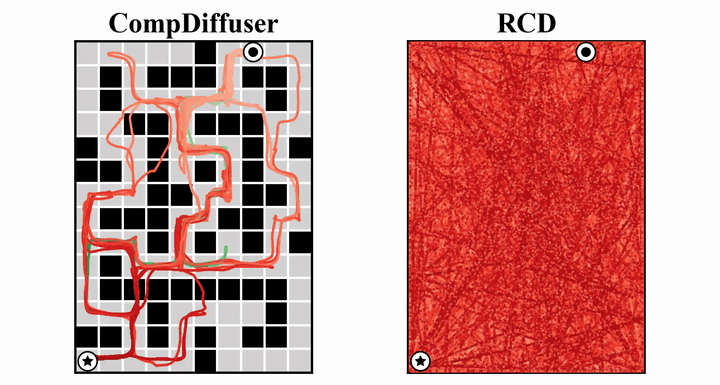
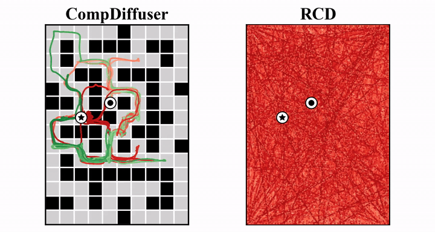

# Refining Compositional Diffusion for Reliable Long-Horizon Planning

[[Project page]](https://refining-compositional-diffusion.github.io/)
[[Paper]](https://arxiv.org/pdf/2605.03075)
[[ArXiv]](https://arxiv.org/abs/2605.03075)
<!-- declare variables -->


[Kyowoon Lee](https://leekwoon.github.io/)<sup>1</sup>,
[Yunhao Luo](https://devinluo27.github.io/)<sup>2</sup>,
[Anh Tong](https://anh-tong.github.io/)<sup>3</sup>,
[Jaesik Choi](https://sail.kaist.ac.kr/members/jaesik/)<sup>1,4</sup>

<sup>1</sup>KAIST,
<sup>2</sup>University of Michigan,
<sup>3</sup>Korea University,
<sup>4</sup>INEEJI


This is the official implementation for "*Refining Compositional Diffusion for Reliable Long-Horizon Planning*" (**RCD**), built on top of [CompDiffuser](https://github.com/devinluo27/comp_diffuser_release).

**RCD** is a *training-free* guidance method for compositional diffusion planning. It combines (1) a **self-reconstruction error** that serves as a density proxy for the composed plan distribution and (2) an **overlap consistency** term that penalizes score disagreement at segment boundaries, steering compositional sampling toward high-density, globally coherent plans without any additional training.

<p align="center"><b>Visual comparison with CompDiffuser on <code>AntMaze-Giant-Stitch</code></b></p>

<table align="center" width="100%">
  <tr>
    <td width="50%" align="center"><b>Task 3</b></td>
    <td width="50%" align="center"><b>Task 5</b></td>
  </tr>
  <tr>
    <td width="50%"></td>
    <td width="50%"></td>
  </tr>
</table>


## 🛠️ Installation
The following procedure should work well for a GPU machine with cuda 12.1. Our machine is installed with Ubuntu 20.04.6 LTS.

Please follow the steps below to create a conda environment to reproduce our results on OGBench environments.

1. Create a python env.
```console
conda create -n rcd_ogbench python=3.9.20
```

2. Install packages in `requirements.txt`.
```console
pip install -r conda_env/requirements.txt
```

3. Install gymnasium, gymnasium-robotics, and torch 2.5.0.
```console
./conda_env/install_pre.sh
```

4. Clone the CompDiffuser-customized OGBench codebase [ogbench_cpdfu_release](https://github.com/devinluo27/ogbench_cpdfu_release) and install it into the conda env `rcd_ogbench`.
```console
## Please set the OGBench path in the script before running this line
./conda_env/install_ogb.sh
```

After these steps, you can use conda env `rcd_ogbench` to launch experiments.


## 🧪 Toy Experiment
A self-contained reproduction of the toy bimodal composition example (Figure 1 of the paper) is provided under `toy_example/`. It includes training of the three local diffusion models on length-3 segments, compositional inference at horizons $L \in \{4, \ldots, 20\}$, and figure assembly. See `toy_example/README.md` for instructions.

<table align="center" width="100%">
  <tr>
    <td width="50%" align="center"><b>CompDiffuser</b></td>
    <td width="50%" align="center"><b>RCD</b></td>
  </tr>
  <tr>
    <td width="50%"></td>
    <td width="50%"></td>
  </tr>
</table>


## 📊 Using Pretrained Models

Since RCD is a training-free method, one can directly reuse the pre-trained CompDiffuser planners and inverse dynamics models released by Luo et al. Please follow the [CompDiffuser release](https://github.com/devinluo27/comp_diffuser_release) for the download links and corresponding config files. After unzipping, the files should be placed under `logs/` with the following structure:

```
└── logs
    ├── ${environment_1}
    │   ├── diffusion
    │   │   └── ${experiment_name}
    │   │       ├── model-${iter}.pt
    │   │       └── {dataset, trainer}_config.pkl
    │   └── plans
    │       └── ${experiment_name}
    │           └── ...
    │
    ├── ${environment_2}
    │   └── ...
```


## 🚀 Running RCD

We provide an evaluation entry point at `diffuser/ogb_task/ogb_maze_v1/plan_ogb_stgl_sml_rcd.py`, which monkey-patches the compose operators for RCD guidance and then delegates to the standard rollout loop. `$GPU` is the GPU index, `$N_EP` the number of episodes (use `100` for the full evaluation), `$SEED` an integer seed. For example:

### AntMaze-Giant-Stitch
```bash
CUDA_VISIBLE_DEVICES=$GPU \
python diffuser/ogb_task/ogb_maze_v1/plan_ogb_stgl_sml_rcd.py \
    --config config/ogb_ant_maze/og_antM_Gi_o2d_Cd_Stgl_PadBuf_Ft64_ts512.py \
    --logbase logs --save_logbase logs_rollout_rcd \
    --pl_seeds $SEED --plan_n_ep $N_EP \
    --eval_method rcd --ev_meta_method rcd \
    --ev_density_p_ratio 0.40 \
    --ev_global_density_weight 0.25 \
    --ev_global_density_inter_rate 5 \
    --ev_global_density_n_mc 1 \
    --ev_global_density_proxy_type coupled_recon \
    --ev_global_density_proxy_overlap_weight 0.5
```

### PointMaze-Giant-Stitch
```bash
CUDA_VISIBLE_DEVICES=$GPU \
python diffuser/ogb_task/ogb_maze_v1/plan_ogb_stgl_sml_rcd.py \
    --config config/ogb_pnt_maze/og_pntM_Gi_o2d_Cd_Stgl_PadBuf_Ft64_ts512.py \
    --logbase logs --save_logbase logs_rollout_rcd \
    --pl_seeds $SEED --plan_n_ep $N_EP \
    --eval_method rcd --ev_meta_method rcd \
    --ev_density_p_ratio 0.40 \
    --ev_global_density_weight 0.25 \
    --ev_global_density_inter_rate 5 \
    --ev_global_density_n_mc 1 \
    --ev_global_density_proxy_type coupled_recon \
    --ev_global_density_proxy_overlap_weight 0.5
```

Replace the `--config` path with any other env-specific config under `config/`. The `--eval_method` flag also accepts `compdiffuser` and `cdgs` for the baselines reported in the paper. Rollout videos and per-episode rollout JSON summaries are saved under `logs_rollout_rcd/${env_name}/plans/${experiment_name}/${seed}/${experiment_time}/`.


## 🏷️ License
This repository is released under the MIT license. See [LICENSE](LICENSE) for additional details.


## 🙏 Acknowledgement
* Thanks to [CompDiffuser](https://github.com/devinluo27/comp_diffuser_release) and [CDGS](https://github.com/UtkarshMishra04/CDGS_ogbench), on which our implementation is built.
* We thank the [OGBench](https://github.com/seohongpark/ogbench) authors for the evaluation benchmark.
